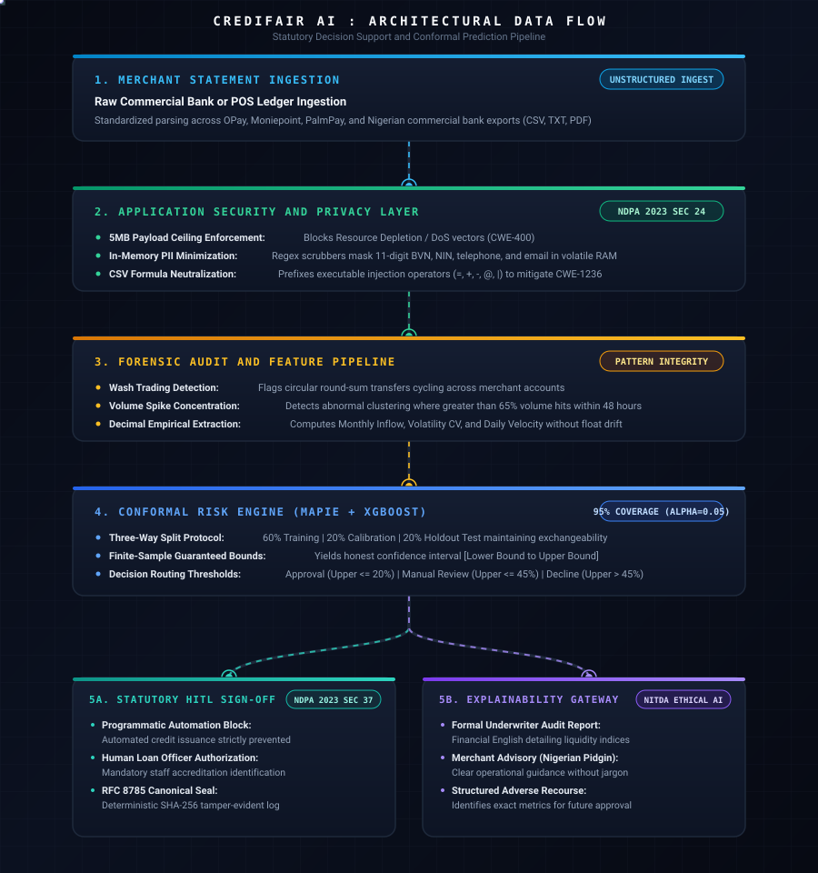

# CrediFair AI: Algorithmic Credit Underwriting for Nigerian MSMEs

Statistically calibrated, distribution-free conformal risk engine and statutory decision-support pipeline for underserved micro, small, and medium enterprises.

---

## 1. Submission Resources

* Track: MIT Open Learning / 3MTT Universal AI Innovation Challenge
* Project Name: CrediFair AI
* Repository: https://github.com/jezreal-dev/credifair.ai
* Live Demonstration: https://github.com/jezreal-dev/credifair.ai
* Video Walkthrough: [Submission Video Placeholder]
* Primary Developer: Jezreal Momoh (https://github.com/jezreal-dev)
* Contact: dev@credifair.ai

---

## 2. Executive Summary

In Nigeria, formal financial institutions systematically exclude micro, small, and medium enterprises (MSMEs) from unsecured debt facilities due to the absence of audited balance sheets, credit bureau histories, and conventional fixed-asset collateral. Commercial credit assessment engines rely on static scoring models that output overconfident point estimates, penalizing informal merchants whose revenues fluctuate with localized commodity seasonality.

CrediFair AI resolves this credit-rationing failure through distribution-free Inductive Conformal Prediction (ICP). The system ingests raw digital point-of-sale (POS) terminal records and commercial bank transaction statements, scrubs personal identifiers in volatile memory, and computes bounded default probability intervals at a certified 95% confidence level:

$$P(Y \in [\hat{y}_{\text{lower}}, \hat{y}_{\text{upper}}]) \ge 1 - \alpha \quad (\alpha = 0.05)$$

The pipeline bridges predictive mathematics and operational compliance by enforcing human-in-the-loop authorization under Section 37 of the Nigeria Data Protection Act (NDPA) 2023, generating verifiable SHA-256 cryptographic audit manifests, and generating actionable dual-language explainability outputs in formal English and Nigerian Pidgin.

---

## 3. Hackathon Rubric Alignment

### 3.1 Problem and Market Impact
* Total Addressable Market (TAM): Over 39.6 million MSMEs operate in Nigeria, representing approximately 96% of registered commercial enterprises and contributing over 48% to the national Gross Domestic Product (GDP).
* Financing Gap: The International Finance Corporation (IFC) and Central Bank of Nigeria (CBN) identify an annual credit gap exceeding $32 billion for formal and informal micro-enterprises.
* Operational Bottleneck: Over 90% of Nigerian micro-merchants operate via daily cash-inflow channels (such as OPay, Moniepoint, PalmPay, and commercial merchant accounts) rather than formal audited books. Traditional bureau scoring categorizes them as unrateable or subprime, resulting in predatory credit terms or total credit denial.
* Economic Value: CrediFair AI qualifies solvent, high-velocity informal businesses using cashflow variance and transaction density, establishing an empirical bridge to working-capital facilities.

### 3.2 Technical Rigor and Mathematical Depth
* Base Predictive Regressor: Gradient-boosted decision trees (`XGBRegressor`) trained on non-mocked transactional indicators (monthly inflow volume, transaction frequency, and coefficient of variation).
* Inductive Conformal Prediction (ICP): Implemented via `MapieRegressor` to compute non-conformity scores without making parametric distributional assumptions regarding underlying cashflow distributions.
* Three-Way Partitioning Protocol:
  * Training Split (60%): Optimizes base regressor parameter weights.
  * Calibration Split (20%): Computes non-conformity residuals to establish exact conformal quantile thresholds ($q_{\text{val}}$) while preserving exchangeability.
  * Holdout Evaluation Split (20%): Evaluates empirical marginal coverage guarantees on unseen merchant data.
* Finite-Sample Statistical Coverage: Guarantees finite-sample coverage at significance level $\alpha = 0.05$:
  * If empirical coverage drops below 95%, interval widths expand automatically to account for high revenue volatility.
  * Eliminates false certainty from single-point default probabilities.

### 3.3 Responsible AI, Regulatory Compliance, and Security
* NDPA 2023 Section 37 Statutory Mandate: Purely automated credit granting is programmatically blocked. Model outputs function strictly as decision-support indicators. Final approval or decline requires a designated loan officer to review metrics and submit supervisory sign-off.
* Cryptographic Audit Logs: Every loan evaluation generates a canonical RFC 8785 JSON manifest sealed with a SHA-256 digest encompassing applicant metrics, conformal intervals, underwriting recommendation, officer credential, and UTC timestamp.
* In-Memory PII Scrubbing (NDPA 2023 Section 24): Ingestion pipelines run regex scrubbers in volatile memory prior to feature computation or model evaluation, stripping 11-digit Bank Verification Numbers (BVN), National Identification Numbers (NIN), telephone numbers, and email addresses. Raw customer identifiers are never saved to disk or transmitted to language models.
* Application Security Hardening:
  * Resource Depletion Defense (CWE-400): Maximum 5MB payload ceiling enforced at the API gateway layer.
  * CSV Injection Prevention (CWE-1236): Strips executable formula triggers (`=`, `+`, `-`, `@`, `|`) from ledger export files.
  * Prompt Injection Filtering (OWASP LLM01): Strips prompt-override delimiters and instruction injections before external LLM calls.
* Forensic Pattern Integrity: Transaction analysis module inspects ledgers for artificial round-sum clustering, wash trading, two-day turnover concentration spikes (>65% volume), and dormancy velocity deficits.

### 3.4 Usability, Explainability, and Localization
* Dual Output Formatting:
  * Credit Officer Audit Report (Formal English): Explicit financial risk profile detailing liquidity ratios, cashflow variance, debt-service coverage, and conformal interval interpretation.
  * Merchant Advisory (Nigerian Pidgin): Actionable vernacular translation breaking down turnover realities, seasonal volatility, and debt-servicing limits without financial jargon.
* Actionable Recourse: Rather than issuing uninformative rejections, adverse explanations explicitly identify the triggering financial vitals (such as turnover drop or excessive withdrawal frequency) and prescribe quantitative improvements required for future qualification.

---

## 4. Architectural Data Flow




---

## 5. Decision Routing Thresholds

Underwriting recommendations depend strictly on the upper bound ($\hat{y}_{\text{upper}}$) of the 95% conformal prediction interval:

| Conformal Interval Upper Bound | Underwriting Determination | Operational Routing Action |
| :--- | :--- | :--- |
| Upper Bound <= 20.0% | Recommended for Approval | Low-risk profile with proven liquidity stability. Eligible for facility origination following supervisory officer sign-off. |
| 20.0% < Upper Bound <= 45.0% | Flagged for Manual Review | Moderate volatility or limited historical span. Requires officer inspection of supplier receipts or inventory cycles. |
| Upper Bound > 45.0% | Recommended for Decline | High default risk or pronounced turnover deficit. Generates structured remediation advisory for future re-application. |

---

## 6. Repository Structure

```text
credifair-ai/
├── api.py                      # FastAPI REST endpoints for headless clients
├── app.py                      # Streamlit inspection and underwriting dashboard
├── credifair_compliance.py     # NDPA Section 37 compliance interceptor and PII scrubber
├── credifair_engine.py         # XGBoost and MAPIE conformal prediction engine
├── credifair_explainability.py # Dual-language LLM and deterministic fallback router
├── credifair_forensics.py      # Forensic wash trading and transaction anomaly detector
├── credifair_ingestion.py      # Decimal-precision financial parser and feature extractor
├── credifair_parser.py         # Multi-format CSV and PDF statement parser
├── credifair_security.py       # Input validation, CWE guards, and prompt sanitizers
├── run_live_audit.py           # Command-line statement audit tool
├── seed_data.py                # Generic MSME archetype definitions and legacy test aliases
├── requirements.txt            # Pinned system dependencies
├── LICENSE                     # Apache License, Version 2.0
├── .gitignore                  # Git exclude specifications
└── tests/
    ├── __init__.py
    ├── test_credifair.py       # Unit tests for ML coverage, PII redaction, and precision
    ├── test_forensics.py       # Unit tests for wash trading and volume spikes
    ├── test_api.py             # FastAPI client endpoint and sign-off tests
    └── test_api_llm.py         # Tests for provider fallback, CORS, and upload limits
```

---

## 7. Installation and Quickstart

### Prerequisites
* Operating System: Linux or Windows Subsystem for Linux (WSL2 Ubuntu)
* Python Environment: Python 3.10, 3.11, or 3.12

### Step 1: Environment Setup
```bash
git clone https://github.com/jezreal-dev/credifair.ai.git
cd credifair-ai

python3 -m venv venv
source venv/bin/activate
pip install --upgrade pip
```

### Step 2: Dependency Installation
```bash
pip install --no-cache-dir -r requirements.txt
```

### Step 3: API Key Configuration (Optional)
Configure an environment file for live cloud language model routing:
```bash
cat << 'EOF' > .env
GROQ_API_KEY=your_groq_api_key_here
GEMINI_API_KEY=your_gemini_api_key_here
FIREWORKS_API_KEY=your_fireworks_api_key_here
EOF
```
*Note: If API keys are omitted, the engine defaults automatically to internal deterministic rule-based explanations with zero service interruption.*

### Step 4: Launch Services

* Launch Headless FastAPI REST Server:
```bash
uvicorn api:app --host 0.0.0.0 --port 8000 --reload
```
Interactive API documentation is accessible at `http://localhost:8000/docs`.

* Launch Streamlit Verification Dashboard:
```bash
streamlit run app.py
```
Dashboard is accessible at `http://localhost:8501`.

* Execute Live CLI Statement Audit:
```bash
python run_live_audit.py --file sample_bodija_market_statement.csv --merchant-name "Bodija Retail Archetype"
```

---

## 8. Verified Test Suite Output

Execution of automated unit and integration tests confirming full verification across statistical coverage, API contracts, security sanitization, and forensics:

```text
============================= test session starts ==============================
platform linux -- Python 3.12.3, pytest-9.1.1, pluggy-1.6.0
cachedir: .pytest_cache
rootdir: /home/jmomoh/credifair_ai/credifair-ai
plugins: anyio-4.15.1
collected 19 items

tests/test_api.py::test_health_endpoint PASSED                           [  5%]
tests/test_api.py::test_profiles_endpoint PASSED                         [ 10%]
tests/test_api.py::test_assess_profile_endpoint PASSED                   [ 15%]
tests/test_api.py::test_analyze_endpoint_with_csv PASSED                 [ 21%]
tests/test_api.py::test_sign_off_endpoint PASSED                         [ 26%]
tests/test_api_llm.py::test_health_check_and_secret_isolation PASSED     [ 31%]
tests/test_api_llm.py::test_cors_headers_present PASSED                  [ 36%]
tests/test_api_llm.py::test_dual_language_format_and_offline_fallback PASSED [ 42%]
tests/test_api_llm.py::test_appsec_file_upload_limit PASSED              [ 47%]
tests/test_credifair.py::test_conformal_engine_coverage_and_archetype_decisions PASSED [ 52%]
tests/test_credifair.py::test_conformal_interval_elasticity PASSED       [ 57%]
tests/test_credifair.py::test_zerodivisionerror_defensive_handling PASSED [ 63%]
tests/test_credifair.py::test_deep_pii_redaction_in_text_descriptions PASSED [ 68%]
tests/test_credifair.py::test_currency_decimal_precision_no_float_drift PASSED [ 73%]
tests/test_credifair.py::test_security_csv_validation_and_injection_filter PASSED [ 78%]
tests/test_forensics.py::test_clean_retail_ledger_passes_forensics PASSED [ 84%]
tests/test_forensics.py::test_round_trip_wash_trading_detection PASSED   [ 89%]
tests/test_forensics.py::test_turnover_spike_anomaly_detection PASSED    [ 94%]
tests/test_forensics.py::test_api_integration_preserves_contract PASSED  [100%]

======================== 19 passed, 1 warning in 5.63s =========================
```

---

## 9. Standards and Licensing

* Regulatory Frameworks:
  * Nigeria Data Protection Act (NDPA) 2023: Section 37 (Automated Decisions) and Section 24 (Data Minimization).
  * National Information Technology Development Agency (NITDA): Ethical Artificial Intelligence Principles.
* Application Security Frameworks:
  * OWASP Top 10: CWE-400 (Denial of Service), CWE-434 (Unrestricted Upload), CWE-1236 (Formula Injection).
  * OWASP LLM Top 10: Mitigation of LLM01 (Prompt Injection) and LLM06 (Sensitive Information Disclosure).
* Cryptographic Specifications: Canonical JSON formatting per RFC 8785, cryptographic digests per FIPS 180-4 (SHA-256).
* License: Licensed under the Apache License, Version 2.0. See [LICENSE](LICENSE) for full legal text.
